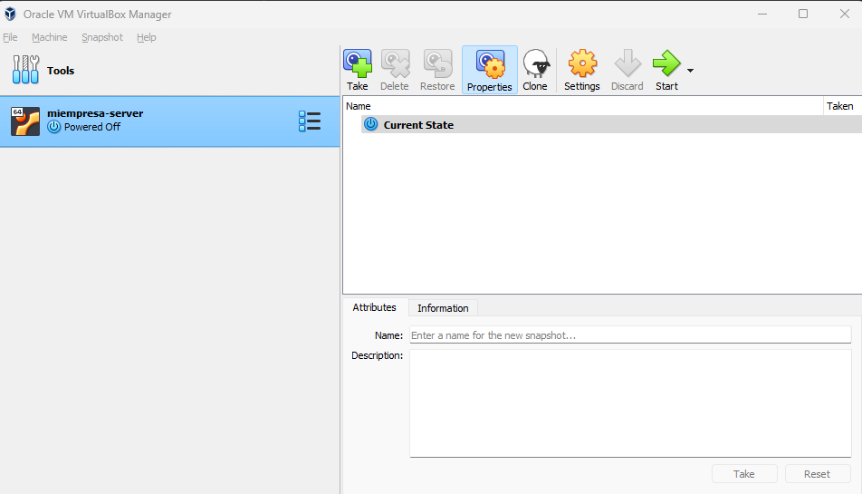
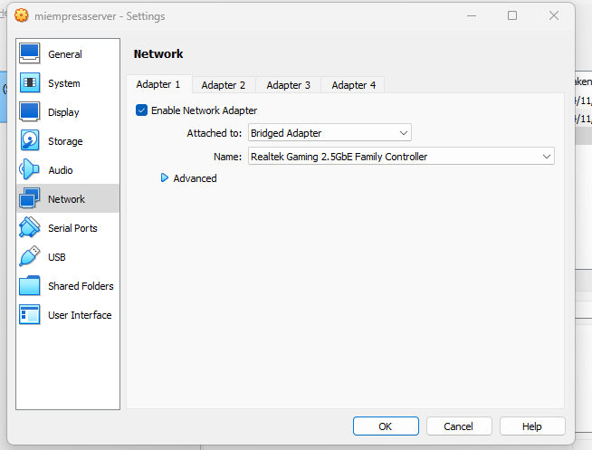

# Instalación de Odoo en Ubuntu Server
Fecha de esta guía Noviembre 2023.
Revisar periódicamente por si hay versiones nuevas del software

##  Creamos una máquina virtual
Esta máquina va a simular que es un server de empresa, salvando las diferencias.

### Especificaciones
Device Specs:
Processor	AMD Ryzen 5 7600X 6-Core Processor                4.70 GHz
Installed RAM	40,0 GB (39,7 GB usable)
System type	64-bit operating system, x64-based processor

Windows Specs:
Edition	Windows 11 Pro
Version	22H2

Virtualization software:
Oracle VM VirtualBox v7


### Creación de la máquina
Descargamos la ISO de aquí https://ubuntu.com/download/server
(idealmente siempre última versión, pero lo que se necesite para realmente
imitar lo que sería la realidad)

Creamos nueva VM:


Nombramos la VM como queramos, seleccionamos dónde se va a guardar
donde queramos, seleccionamos la ISO que hemos descargado antes,
**importante**, decimos que no queremos *Unattended Instalation*


Seleccionamos hardware a virtualizar según nos permita nuestro host.
(idealmente no menos de 4GiB de RAM y 2 procesadores)


Le damos espacio de disco suficiente. 25GB está ok, si podemos darle más
mejor, pero puede darnos problemas para clonar. **No** queremos que haga
preallocate, lo queremos en dinámico


Ya tenemos la máquina pero tenemos que instalar el OS:



Damos a arrancar la máquina. Try or install ubuntu server. 
Que haga sus cosas. En algún momento nos dejará seleccionar idioma.
Yo elgijo inglés, pero libertad en esta selección.

Si detecta un nuevo instalador, que lo use.
Que detecte el keyboard automático o como prefieras.
Tipo de instalación, la por defecto. Third party drives sin seleccionar.
Networks connection, default.
Proxy en principio no necesitamos.
Archive mirros, default.
Storage configuration, los default.
Revisamos config, le decimos que Ok si estamos OK.

Creamos nuestro perfil. Poner tu nombre, llamos al server como quieras,
username el que quieras. No actualizamos a Ubuntu Pro. Instalamos OpenSSH 
server, no importamos keys. No instalamos ningún snap.

Cuando esté, decimos que reboot now.
Dirá que algo failed; simplemente pulsamos enter.

Cuando nos deje, nos loggeamos con el usuario que hemos creado.
Ya tenemos instalado el OS; tomamos snapshot por si acaso.

Dirá que podemos actualizar cosas; las actualizamos con
```
sudo apt update && sudo apt upgrade
```

Si se queja de daemons using outdated libraries, aceptamos lo que nos dice.
Tomar snapshot por si acaso.

Cuando tengamos el control de nuevo; vamos a checkear el ssh; por la CLI
escribimos ``ssh``, debería contarnos cosas. Si dice que no sabe lo que es, 
instalarlo: 
```
sudo apt-get install openssh-server
```

Apagamos la máquina:
```
sudo poweroff
```

Vamos a los settings de la máquina, network, cambiamos a Bridged Adapter:



Esto hace que la VM sea una máquina más en mi red local.
Podemos comprobarlo viendo que ahora su IP es la misma que la de mi
red local, para ver la ip le decimos (al Ubuntu):

```
ip address
```


Tomamos snapshot

## Instalar Odoo en Ubuntu server
Si vamos a hacer la instalación en un sitio de idioma no ingles, suele ser buena
idea configurar idomas locales para que las cosas vayan bien. 
Se instalan con
```
sudo apt install locales
```

Se configuran con:
```
sudo dpkg-reconfigure locales
```

(yo voy a seguir en inglés así que me salto este paso)

Actualizamos los paquetes con:
```
sudo apt update && sudo apt upgrade -y
```

Configuramos el sistema para instalar Odoo16 (última versión). 
Para descargar los paquetes le instalamos:
```
apt install ca-certificates wget gnupg
```

Instalamos la key para que los repos de Odoo sean confiables:
```
wget -O - https://nightly.odoo.com/odoo.key | sudo apt-key add -
```

Creamos un fichero con la info de los repos de Odoo (necesario pasar a root)
```
echo "deb http://nightly.odoo.com/16.0/nightly/deb/ ./" > /etc/apt/sources.list.d/odoo16.list
```

Si no tenemos la password de root, podemos machacarla con:
```
sudo passwd root
```

Pedira una nueva pass. Luego podemos loggearnos como root con
```
su root
```

Nos logeamos de nuevo con nuestro usuario.
Actualizamos paquetes e instalamos Odoo:
```
sudo apt update && sudo apt install odoo
```

Si todo ha ido bien, deberíamos tener usuarios para odoo y postgresql.
Podemos verlos ejecutando:
```
less /etc/passwd
```
(pulsar `q` para salir de la vista)


Vamos a lanzar el servicio Odoo desde el usuario odoo.
Tenemos que darle una passwd y una shell. Para ello ejecutamos:
```
sudo passwd odoo
sudo usermod -s /bin/bash odoo
```

Cambiamos al usuario odoo (`su odoo`); comprobamos que su dir personal
es `/var/lib/odoo` (loggeados en odoo, dices `cd` y te debería llevar ahí)


Para que Odoo funcione, necesita el servicio Postgresql.
Lo iniciamos con
```
service postgresql start
```
(seguramente pida autenticación).
Cambiamos al usuario postgres (si es necesario, darle nueva password)

Si nos metemos a la DB con
```
psql
```

y decimos que nos muestre los usuarios:
```
\du
```

deberíamos ver 2 usuarios: odoo y postgres. Damos (si no lo tiene) al usuario
odoo permisos de superuser y de creación de DB:

```
ALTER USER odoo CREATEDB;
ALTER USER odoo SUPERUSER;
```

Salimos de la terminal con `exit`.

Volvemos al usuario odoo, y lanzamos el servicio con:
```
odoo
```

Si da un error del tipo:


Es porque el servicio ya estaba corriendo; lo vemos con:
```
service --status-all
```
(deberías ver un +). Lo paramos con:
```
service odoo stop
```

Y lo reiniciamos con
```
odoo
```

Si ha ido todo bien, veremos esto (los logs):


Si vamos al navegador, y metemos
```
http://IP:8069/
``` 

donde IP es la IP que tiene nuestra VM via el bridged adapter, veremos
el servicio odoo:


Y a la vez podremos ver que los logs se actualizan en directo. Es interesante
a la hora de desarrollar verlos.


Podemos parar el servico con ctrl+c

Comprobamos que, al reinciar el server, los servicios están arriba. No interesa
eso en desarrollo, configuramos paraque tenga que ser el user odoo el que 
manualmente lo lance:

```
sudo systemctl disable odoo
sudo systemctl disable postgresql
```

Reiniciamos y vemos que ya los servicios no se inician en boot.

Para iniciarlos, desde nuestro usuario podemos iniciar postgresql
con 
```
sudo systemctl start postgresql
```

y luego nos pasamos al usuario odoo y lanzamos
```
odoo
```

para iniciar el servicio y ver los logs.
El fichero de config de odoo está en `/etc/odoo/odoo.conf`

---------

Nos dará un pasword master (guardar), y podemos crear una DB y empezar a
toquetear cosas. Comprobar, tras crear la DB, que se ha creado
via user postgres --> psql --> \l

## Desinstalación
`apt remove --purge odoo` (purge elimina dependencias)

## Cosas

# ***REVISAR ESTO***
Todo lo que hemos hecho hasta ahora está orientado a un server de odoo
*para desarrollo*. En un entorno de desarrollo la seguridad no es muy
importante. Lo que me importa más es tener un sitio de fácil acceso a
"las cosas que toqueteo". Además, al toquetear, seguramente nos carguemos
cosas, cosa que en producción no puede ocurrir. Además de que configuraciones
en desarrollo suelen no ir de la mano con como debe ser en producción.

Además, el crear el usuario odoo para lanzar el servicio es justo para aislar 
y que el sevicio solo se lance con odoo, no con root.

Es conveniente que el usuario con el que se desarrolle en el servidor
sea el que lanza el servicio. Por eso le dimos una consola antes.

En prod NO hacer esto, es decir, el usuario que controla el servicio mejor 
que no tenga shell.


**PDTE ver esto**: que existe el fichero "odoorc" en el home del usuario que
lanza. Es un fichero de config espcífico. Es el que tocaremos para desarrollo si
queremos cambiar cosas. Ver que también existe `/etc/odoo/odoo.conf`, que es la 
config base.

Para decirle a odoo (desarrollo) donde están los módulos que va a usar,
podemos usar

```
odoo --addons-path="/var/lib/odoo/modules,/usr/lib/python3/dist-packages/odoo/addons" --save
```
para que sepa donde hay módulos y ue se guarde las rutas (mira que la primera
es el home del usuario odoo)


Para producción nos interesa que tire solo, para desarrollo iiciarlo a mano,
y poder ver el log en directo

## Instalación de Odoo para producción en Docker Container
PDTE

## Instalación de Odoo en windows
seguramente ejercicio, y tambie´n en otro OS (Debian Desktop Linux, como SaaS)


## Tutoriales
- https://hibbard.eu/install-ubuntu-virtual-box/
- https://askubuntu.com/questions/3596/what-is-lvm-and-what-is-it-used-for