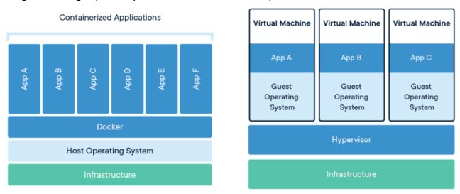
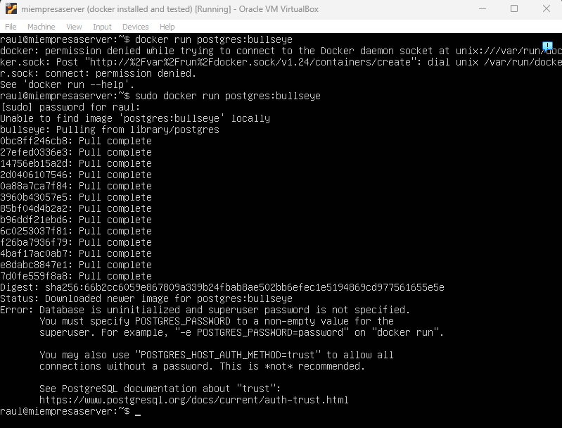
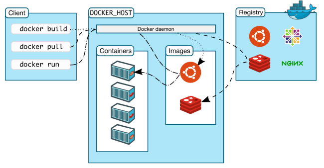
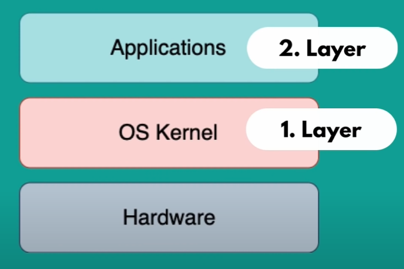
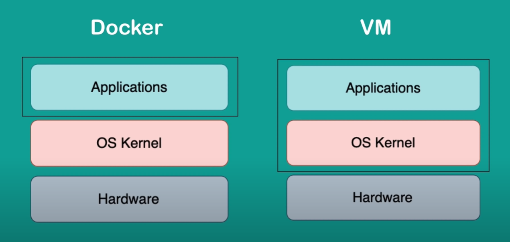

# Intro
Para probar cosas (un OS, una config específica, despligue de una app...)
a veces necesitamos una máquina física que no tenemos (tendremos nuestro
equipo de desarrollo con sus config locales). Un posible solución es 
virtualizar la máquina que necesitamos y hacer las cosas ahí.

La virtualización que se suele ver es de hypervisor,
que simula total o parcialmente un hardware sobre el que podemos correr un OS
y a efectos tenemosn una máquina de verdad.

Un *contenedor* usa el OS del host donde corre y es un "entorno privado"
que comparte recursos con el host, pero no virtualiza (todo) el hardware.
Suelen tener entornos privados a nivel procesos, memoria, ficheros y red.

Se puede entender un contenedor como un "paquete" que tiene todo lo necesario
para que corra una aplicación (dependencias + config), que es portable.



Se hace la comparación con contenedores de mercancías de la siguiente manera:
un contenedor de mercancías tiene que cumplir unos estándares para  poder
ser transportado; si lo cumple, cualquier barco que pueda transportarlo lo
hará independientemente de lo que haya en el contenedor.

## Contenedores y desarrollo
Sin contenedores, la idea geenal de desarrollo es que el desarrollador 
(o equipo) tendrán que descargar y configurar servicios que use su app en 
local (su equipo de desarrollo). Esto es doloroso en general.

Si tienes containers, solo hay que buscar la imagen de la app/servicio que
quieras y correr el comando (que es universal) para que corra y magia, tengo
un entorno aislado con la app/servicio disponible. Además que puedo tener
*a la vez* de distintas versiones de una misma app/servicio (pq los 
containers están aislados, no hay conflicots de versiones)

## Contenedores y deployment
Sin containers, el equipo de dev creará un artifact + instrucciones de 
instalación y config que hay que aplicar en el entorno del server. Esto
hace que te comas instalación y config en el server (con sus posibles 
confilcots de versiones más malentendidos, pq las instrucciones están
escritas por personas). 

Con contenedores, el equipo de dev crea una imagen (un cointendeor) de la app
junto con todo lo que necesita (dependencies+config) y eso "se manda" al server
y corre la app como un contenedor (solo hay que configuar en el server el
runtime)

## Otras ventajas
Ocupan menos espacio pues no virtualizan todo un OS, usan el del host. La 
ejecución es más rápida que una VM (comparble en la mayoríoa de ocasiones
a instalación local)

## Pequeños incovenientes
La persistencia requiere algo de trabajo extra, y se usan de manera casi 
exclusiva via CLI

## Cuando usarlos
Como usuario, para aprender/probar una aplicación/servicio (te ahorras
install+config, solo hay que descargar una imagen de un repo [en lenguaje
de containers se llaman *registries*]).

Como dev, para desarrolo de app distibuible en local o desplegable en server
que quite los poblemas de configuración (pues se "empaquetan" con el container).
También para testear con diferentes configs, recursos limitados... Es fácil
generar entornos de development y producción.

## Contenedor
Tecnicamente un container es un stack de *images*, y la image base suele
ser un linux alpine (alguna versión) u otra distro, pero lo importante es que
sea lightweight, eso hace que los containers no se coman mucho espacio.
"Arriba" tendrás la image de la aplicación que va a correr en el container,
y entre la base y lo de arriba habrá otras images que hacen posible que corra
la app que tu quieres.

### Ejemplo
**hacer primero instalación**
Vamos a docker hub https://hub.docker.com, buscamos nuestra app favorita 
(por ejemplo postgres),
veremos una serie de images públicas de esa app; con
```
sudo docker run postgres:version-tag
```
le estamos diciendo a docker que cree un contenedor con la version que queremos
de postgres. Si no encuentra localamente las imágenes que necesite, las 
descargará de docker hub.

**Ojo**: docker run crea contenedores, no los arranca. Cada docker run creará
un contenedor distinto de la misma imagen.



La descarga es de todo aquello que no encuentra localmente; si luego descargas 
otra imagen con otra versión de la app, seguramente compartan layers de imágenes 
y solo necesitas descargar esas.

**Nota** seguramente no tire de una el container porque se necesita cierta
config para incializar la DB. Probar con otra app si es necesario (por ejemplo,
`sudo docker pull ubuntu`, luego inciamos con `sudo docker run -it ubuntu`.
Veremos que nos "lleva" a otra máquina ubuntu, y nos loggea como root.
Además, si hacemos 2 veces `sudo docker run -it -d ubuntu` veremos que crea
2 containers de la misma imagen).

**Nota**: si vamos a "llenar de mierda" las cosas probando distintas images,
las podemos borrar todas luego con:
```
sudo docker rmi -f $(sudo docker images -aq)
```

Idem para los contenedores:
```
sudo docker rm -f $(sudo docker container ls -a -aq)
```

Para ver los containers que están corriendo:
```
sudo docker ps
```

Los containers tienen, entre otras cosas, un puerto binded para poder hablar
con la alplicación, y su propio sistema (virtual) de ficheros, donde podemos
meter y tocar cosas.

## Images
Las imágenes son el empaquetado en sí, lo distribuible. Incluyen no solo la app,
también las specs y un script para que docker sepa lanzarlo. Un contenedor
es una imagen corriendo. 


## Docker
Docker es un sistema de contenedores Linux (más info: https://www.docker.com/)
Su arquitectura es la siguiente:



- El cliente es quien habla con el server DOCKER_HOST
- El server gestiona queries de clientes y los contenedores en sí
- El registry es un repo de imagenes de Docker- Puede ser público (el más
conocido es https://hub.docker.com/) o privado (de una empresa con sus propias
images)

## Docker vs VM
Un OS funciona en 2 capas: el kernel y por encima las apps. A mismo kernel con
diferentes apps por encima lo que tenemos es distinto:



Docker virtualiza en la capa de apps; usa el kernel del host. Una VM tiene
su propio kernel, y virtualiza eso tambie:



Esto hace que las docker images sean más rápidas y menos pesadas. A cambio,
puedes tener problemas de compatibilidad. Una VM puede tener cualquier  OS host.
Un docker container en general no, porque (seguramente) la base image sea
un linux, y eso sabe hablar con un kernel linux, no con otros en general

## Instalación de Docker en Ubuntu

**Nota**<br/>
Vamos a hacer las cosas en nuestro "server" Ubuntu o en otra máquina Linux
ya que, como se dijo por arriba, la imagen base de prácticamente cualquier
container suele ser una distro de Linux; eso hace que suela dar dolores de
cabeza usar Docker sobre otros OS.

Docker es Open Source y tiene (al menos) 2 versiones: CE y EE (Community/
Enterprise Edition). Vamos a usar la CE. 

Hacemos la instalación desde el repo oficial de Docker CE.

Primero, si tuviésemos instalado alguna versión antigua, quitarla:
```
sudo apt remove docker docker-engine docker.io containerd runc
```

Actualizamos índice de paquetes:
```
sudo apt update
```

Añadimos Docker GPG official key:
```
sudo apt update
sudo apt install ca-certificates curl gnupg
sudo install -m 0755 -d /etc/apt/keyrings
curl -fsSL https://download.docker.com/linux/ubuntu/gpg | sudo gpg --dearmor -o /etc/apt/keyrings/docker.gpg
sudo chmod a+r /etc/apt/keyrings/docker.gpg
```

Añadimos el repo a apt sources:
```
echo \
  "deb [arch="$(dpkg --print-architecture)" signed-by=/etc/apt/keyrings/docker.gpg] https://download.docker.com/linux/ubuntu \
  "$(. /etc/os-release && echo "$VERSION_CODENAME")" stable" | \
  sudo tee /etc/apt/sources.list.d/docker.list > /dev/null
sudo apt-get update
```

Instalamos paquetes:
```
sudo apt install docker-ce docker-ce-cli containerd.io docker-buildx-plugin docker-compose-plugin
```

Si todo ha ido bien, lanzamos:
```
sudo docker run hello-world
```

y/o
```
sudo docker version
```

Y nos debería decir cosas.

### Post install
(no lo hago de momento)
https://docs.docker.com/engine/install/linux-postinstall/

### Desinstalación
Lanzamos
```
sudo apt-get purge docker-ce docker-ce-cli containerd.io docker-buildx-plugin docker-compose-plugin docker-ce-rootless-extras
```

Imagenes, containes, config personal o volúmenes hay que quitarlos manualmente:
```
sudo rm -rf /var/lib/docker
sudo rm -rf /var/lib/containerd
```

## Comandos básicos
### docker pull image:tag
para descargar una imagen. El nombre de la imagen es
```
registry/iamge-name:version-tag
```

Si no especificamos el registry, docker asume que es docker hub

### docker images
Para ver las imágenes descargadas, para obtener un listado (de los IDs):
```
docker images -aq
```

Si solo metemos el comando q, son las imágenes que no usa algun contenedor.
Puede ser útil para borrar solo las imágenes que estamos usando en contenedores

### docker run image:tag  
Crea un contenedor de la imagen. Si quiero que el container corra en segundo
plano, 
```
docker run -d image:tag
```

Para poder acceder a la aplicación que corre ene le container, tenemos que
hacer un port binding. La aplicación tendrá su port de container, y en
el momento que le pido correr, puedo especificar:
```
docker run -p1234:4321 image:tag
```

donde 1234 sería el puerto del host y 4321 el puerto de la aplicación del 
container. Desde el host podría pedir conexión al puerto 1234 y docker
se encarga de mandar esa petición al puerto correcto del container.
Esto es útil para 2 containers de una misma image (o distintas versiones
de una misma app) que tendrán el mismo puerto de escucha de container.

También podemos dar un nombre al container en creación (si no se le asigna
uno random). El nombre a efectos funciona como el ID.
para ello:

```
docker run --name nombre-de-mi-container image:tag
```

La sinstaxis completa es:
```
docker run [PARAMS] image [INITIAL COMMAND] [ARGS]
```

Parámetros habituaes:
- i: entra en modo interactivo
- t: asigna una pseudoterminal para que tengamos acceso desde la nuestra
- rm: cuando el contenedor se pare, que se borre
- d: deattached, que corra en 2º plano
- p: para decir el oport binding. Siempre en mono host:container
- e: para dar valor a variables de entorno

### docker create
igual que run pero solo crea el container, no lo inicializa

### docker start containerID
Proporcionando el ID del container lo iniciamos (recuerda que run crea nuevos
contenedores de la misma image; este es el comando para que corra un contenedor
que ya existe). Se inicia con el comando que se dijo en create/run

### docker restart containerID
hace restar al container proporcionado via ID

### docker stop containerID
Proporcionando el ID del container lo paramos

### docker ps
lista los contenedores que están corriendo. Si añado la opción
```
docker ps -a
```
lista también los contenedores que no están corriendo.
La info que dice es:
- CONTAINER_ID: el id del conatiner
- IMAGE: la imagen desde la que se crea el container
- COMMAND: lo que se ejecuta al iniciar el contenedor
- STATUS: si el container está on/off y desde hace cuánto está en ese estado
- PORTS: el port binding host--> container que hayamos indicado
- NAME: el nombre del container (a efecto, como el ID)

### docker rename name1 name2
renombra contenedores creados

### docker tag name1:tag name1:tag2
renombra imagenes

### docker logs containerID
vemos los logs de un contenedor 

### docker rm containerID
borra un container o listado de containers (separados por espacio)

### docker rmi imageID
borra image o listado de images.

### docker rm containerID
borra container o listado de contaners

### docker system prume -a
Elimina imagenes y contenedores parados

### docker exec -it containerID /bin/bash
me permite meterme al container que está correidno para ver qué pasa por dentro.
(al final del día los containers son "su propio equipo con linux por debajo
y mi app y todo lo que necesite al final")

Realmente docker exec permite ejecutar un comado dentro del container.
Por ejemplo
```
docker exec -d contenedor touch /tmp/prueba
```

crea un fichero por dentro "sin que nos enetermos".

La sintaxis general es 
```
docker exec [OPTS] containerID COMMAND [PARAMS]
```

### docker cp
permite la copia de ficheros/dirs de host a container y viceversa.
Por ejemplo 
```
docker cp containerID:/tmp/test ./
```

copia del container a mi host, y 
```
docker cp ./folder containerID:/tmp/
```

copia de host a container

### docker attach containerID
enchufamos nuestra terminal a la del container que está corriendo

## Creando images de contenedores existenes
Cada imagen es una capa de imágenes; así que puedo crear mi propia imagen
a partir de una dada. Para ello, con una imagen modificada 
(por ejemplo me creo un ubuntu y añado un holi):
```
sudo docker run --name ubu -d -it ubuntu /bin/bash
sudo docker exec -d ubu touch /tmp/holi
```
Para crear mi propia imagen desde ese container modificado, hago:
```
sudo docker commit -a "author" -m "coment" containerID newImageName:tag
```

por ejemplo:
```
docker commit -a "raul" -m "ubuntu con holi" ubu raul/holiubu:v1.0
```


crea una imagen que parte del ubuntu con holi. Si creo nuevos contenedores
con la imagen "ubunto" no tendrán el holi, pero los contenedores creados
con raul/holiubu:v1.0 sí

### subiedo imagenes a registry
#### docker hub
Te creas cuenta en  https://hub.docker.com y creas un repo (es fácil)
Te loggeas en docker con
```
docker login
```

Y finalmente:
```
docker push image-name:tag
```

y estará en el repo; ahora es descargable con un docker pull

#### AWS
PDTE

## Creando imágenes con Dockerfile
Nos permite crear imágenes propias de una forma más consitente.

**Nota**: a partir de aqui necesitaré un GUI porque quiero usar VSCode.
Hacer los apaños pertinentes a la VM e instalar VSCode.
(GUI: lubuntu desktop que es lightweight `sudo apt install lubuntu-desktop`)
(VSCODE intall: https://linuxhint.com/install-visual-studio-code-ubuntu22-04/)

Creamos una carpeta donde sea, y creamos un fichero que se llame *Dockerfile*.
Este fichero va a contener las instrucciones para crear nuestra imagen.
Al abrirlo con VSCode, si nos dice que si queremos las extensiones recomendadas, 
le decimos que sí. 

Las instrucciones posibles son:

- FROM image: toda imagen parte de otra imagen, así que es necesario decir de 
donde venimos
- CMD command: este es la última instrucción, y es el comando que se tiene que
ejecutar cuando se cree el contenedor
- Entre medias podemos poner una serie de comandos, que serían los que
hemos hecho "a mano" para crear nuestra image. Las opciones más habituales:
  - RUN linux command: un comando de linux que se ejecutará sobre la base image
  - COPY ruta-a-fichro-en-host ruta-a-fichero-en-container copia cosas desde el
  host al container
  - WORKDIR algun-dir: cambiamos, en el container, el working directory. Si no
  existe se crea
  - ENV: permite crear variables de entorno para el contanier (aunque en general
  van mejor en un docker compose)
  - (hay más...)


Por ejemplo, el siguiente fichero Dockerfile:
```
FROM ubuntu:latest
WORKDIR /tmp/
RUN touch holi
COPY ./otra-cosa.txt /tmp/
CMD /bin/bash 
```

haría los mismo que hemos hecho antes a mano, más copiar un fichero
txt dsde el host al container (cuidado con los paths a la yhora de lanzar
el comando ue crea image; por ejemplo yo aquí tenía en la misma carpeta
que el dockerfile el "otra-cosa", de ahí el relativo)


Para crear una imagen desde un Dockerfile lanzamos
```
docker build -t ImageName:tag path-2-Dockerfile 
```

En general, si te quieres ahorrar problemas, lanza el comando de build
desde la misma carpeta donde está el Dockerfile y basta poner "./"

Si ahora comprobamos las imágenes, veremos que tenemos nuestra imagen creada

### Ejercicio
Crear una imagen que corra un programa HelloWorld en java en un container
(sin tener instalado en el host java). El resultado de correr la imagen
debe ser que aparezca por pantalla "Hello World!"

## Networks
De momento solo hemos visto containers de manera aislada. Docker permite crear
redes de containers para que se comuniquen entre sí de manera sencilla.

Por defecto, Docker me incluye 3 redes, que puedes ver con
```
docker network ls
```

Las 3 redes por defecto son:
- bridge: la por defecto de cualquier container, con IP propia
- host: un container en esta red usa la misma config de red que el host
- none: no permite acceso a otras redes

En general nos interesará crear nuestrar propias redes de contenedores,
por ejemplo para aislar comunicaciones (contenedores de test vs contenedores
de dev; simulación de una red de servicios...)

Para crear una red, tan fácil como:
```
docker network create network-name
```

Este comnado pede aceptar algunos parámetros, que de momento me salto porque
no los voy a usar.

para eliminar red:
```
docker network rm networkID
```

(igual que con los contenedores, el name funciona como ID)

### Asignar un contenedor a una red
Al crear un container (run/create), si no dices nada por defecto va a bridge.
Si quiero que forme parte de una red, tenemos que meter el parámetro 
`--network network-name`.

Por ejemplo, esto crea un contenedor y lo añade a la red test:
```
docker run -it -d --name ubu --network test ubuntu:latest /bin/bash
```

Para ver que esto funciona, podemos crear otro contenedor con otro ubuntu;
(seguramente) neceistamos instalar el ping; podemos hacerlo con (te metes
al container):
```
apt update && apt upgrade -y
apt install iputils-ping
```

Y, si hacemos un ping desde este segundo ubuntu al primero, no hace
falta decir la IP; Docker hace un DNS interno con el que si proporcionamos
en name del container, sabe resolver la dirección.

Otra opción para conseguir el mismo resultado sería, al crear el container,
dar el parámetro `--network-alias nombre`

Para conectar/desconectar containers de una red, se usa el comando
```
docker network connect/disconnect networkID containerID
```

Un container puede estar en varias redes. Por ejemplo, puedo crear otra red
(test2), otro container asigando a esa red, y asignar el primer container
a esa segunda red. Podemos comprobar que si nos metemos al tercer container 
(tras instalar ping), podemos ahcer ping (por nombre de container) al 
primer container pero no al segundo
**PDTE: (hacer dibujo de las redes)**

### Ejemplo
Creamos 2 contenedores, uno con Postgres y otro con Pgadmin (utilidad
para administrar via browser Postgres). Los vamos a meter en la misma
red y vemos que los contenedores se ven.

Primero creamos la red:
```
docker network create dbnetwork
```

Creamos el container para postgres. Hay que especificar algunas cosas, tenemos
que leer la docu oficial de docker:
https://hub.docker.com/_/postgres

Ahí nos dice que hay que especificar una variable de entorno para el password
con `-e POSTGRES_PASSWORD=password`, que es el password del superuser; 
opcionalemnte podemos configuar también una variabl de entorno para
el nombre del superuser con `-e POSTGRES_USER=user` (creo que el por defecto
se llama *postgres*). También queremos hacer un port binding para poder
comunicarnos desde el host con el container; el puerto de escucha por defeccto
de postgres es 5432, así que hacemos el binding al mismo puerto del host
con `-p 5432:5432` (esto siemre se especifica como -p HOST:CONTAINER)

Entonces, el comando:
```
docker run -d --name postgresdb -e POSTGRES_USER=admin -e POSTGRES_PASSWORD=admin --network dbnetwork -p 5432:5432 postgres
```

Me crea el container que quiero.

Hacemos los mismo para crear un container para pgadmin, aunque requiere algo de 
trabajo extra. No hay imagen oficial de pgadmin pero hay imágenes en dockerhub,
en concreto vamos a usar esta: https://hub.docker.com/r/dpage/pgadmin4,
que está bastnte mal docuumentada, pero si buscas un poco encuentras cómo
crear el container para esta image: 
https://www.pgadmin.org/docs/pgadmin4/latest/container_deployment.html.

Entonces, resulta que para crear este container tenemos que definir 2 variables
de entorno: PGADMIN_DEFAULT_EMAIL (puedes poner un mail falso, es solo para 
loggear) y PGADMIN_DEFAULT_PASSWORD. El puerto de escucha por defecto de pgadmin
es 80, así que haremos ese binding. Entonces, con el comando:
```
docker run -d -p 80:80 -e PGADMIN_DEFAULT_EMAIL=user@domain.com -e PGADMIN_DEFAULT_PASSWORD=pgadmin --name pgadmin --network dbnetwork dpage/pgadmin4
```

creamos el contenedor para pgadmin. Si todo ha ido bien, tendremos los 2 
containers corriendo, y poidemos conectarnos via browser a pgadmin, bien desde
el host (mi VM), o si estamos en bridged adapter, podemos usar el host del host
y conectarnos por ahí

(jugar un poco para ver que está bien, que se crean tablas, se meten datos, etc)
**NOTA**: tras jugar un poco metiendo datos, reseteando contenedores, haciendo
reboot del sistema... resulta que hay persistencia de datos sin que yo diga 
nada. Este comportamiento me sorprende, ya que debería haber especificado
que cree volúmenes para almacenamiento; no sé si lo está haciendo por detrás
sin que yo me entere...

## Docker compose
Docker compose es una utilidad para lanzar varios contenedores a la vez,
ya que es común que al desarrollar una aplicacion necesitemos de varios 
servicios, por lo tanto de varios contenedores.

Se usa un fichero *yaml* para definir el comportamiento.
Primero veamos que tenemos instalado docker compose con:
```
docker compose version
```
(si no lo tenemos instalar: 
https://docs.docker.com/compose/install/linux/#install-using-the-repository)


Es habitual tener le fichero yaml en el root del directorio de trabajo; su 
propósito es inicializar toda la red de contenedores que vamos a usar
para desarrollar. Creamos una carpeta para testeo y dentro un fichero
`postgres-pgadmin.yaml` para levantar los 2 containers de antes de una.

Dentro del fichero yaml hay que poner la info ue pondríamos en los
comandos `run/create` de los contenedores:

```
services:
  postgresdb:
    cointainer_name: postgresdb
    image: postgres
    ports:
      -5432:5432
    environment:
      - POSTGRES_USER=admin
      - POSTGRES_PASSWORD=admin
    restart: always
  pgadmin:
    container_name: pgadmin
    image: dpage/pgadmin4
    ports:
      - 80:80
    environment:
      - PGADMIN_DEFAULT_EMAIL=user@domain.com
      - PGADMIN_DEFAULT_PASSWORD=pgadmin
    depends_on:
      - postgresdb
```
Lo que hace cada cosa es bastante ovio; solo merece la pena comentar
el comando "restart", con posibles valores: no (default), always (siempre
que se pare el container), on-failure (si falla) y "unless-stopped" 
(salvo que lo pare manualmente)

**Nota**: hay más comandos posibles, de momento no los necesito

Cuando tengamos listo el fichero yaml, lo ejecutamos con
```
docker compose -f ./postgres-pgadmin.yaml up
```

(asumiendo que pwd es donde está el fichero, si no dar ruta hata fichero)

Y esto lo que hace es no solo crear los containers, si no también su porpia 
network en la que están ambos.

Si queremos eliminar todos los containers y de gratis eliminar la network solo
hay que hacer
```
docker compose -f ./postgres-pgadmin.yaml down
```

## Docker Volumes
Se usan para la persistencia de datos; cada vez que borremos el container
los datos se pierden (y cmo en general vamos a usar docker compose para
lanzar/parar todo, necesitamos decirle que no elimine datos.)

La idea es muy tonta: se "enchufa" el filesystem del host al filesystem
virtual del contenedor; cuando el container escribe en su filesystem, se replica 
en el host, y viceversa.

Hay varias maneras de hacer esto, pero la más usada es "named volumes", que
consiste en dar un nombre a la carpeta del host que va a tener los datos,
y referenciar el path a los datos a almacenar del container. Docker se encarga
del resto. Quizás necesitemos también usar un mapeo explícito; solo
hay que decir ruta de host:container

Como ya vamos a usar en general simepre docker compose, los volumes se definen
también en el yaml bajo el servicio:

```
services:
  postgresdb:
    ...
    volumes:
      - vol-name:/path/in/container # named volume
      - /path/in/host:path/in/container # explicit volume
...
volumes:
  - vol-name: # hay que decir al final los named volumes
```

**Nota**: se puede definir una misma carpeta en el host para diferentes
volumes de diferentes containers; es una manera útil de que compartan datos.

Para el servicio Postgres, los datos se almacenan en: `/var/lib/postgresql/data`
así que ese el el path a referenciar en el container.

## Tutoriales:
- https://www.youtube.com/watch?v=3c-iBn73dDE
- https://docs.docker.com/engine/install/ubuntu/
- https://www.youtube.com/watch?v=PivpCKEiQOQ