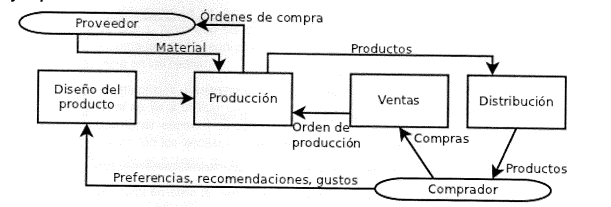

# Implantación de un SGE (Odoo) en empresa

## Idea ejercicio
Cada persona actúa como cliente y como implantador del ERP.

### Como cliente
Como cliente, siempre partimos de "cero", es decir, no existe un sistema
informático previo que gestione recursos de la empresa. Tenemos que 
tener claro qué hace nuestra empresa y definir entre 3 y 5 "problemas"
que un sistema ERP nos pueda apañar.

Ejemplo: mi empresa es un bar, y quiero gestionar los pedidos de bebidas,
los turnos de los empleados y la contabilidad.

También tenemos que pedir cierta personalización en cuanto a vistas/menús
e informes para poder ver cómo funcionan las cosas.

Ejemplo: de las bebidas, quiero poder ver el listado de proveedores
y su gradación alcohólica. Además, quiero que se me generen informes del
tiempo medio que tarda cada proveedor en proveer repuestos y cómo es 
la distribución del consumo de los clientes por producto y tiempo 
(diario, semanal, trimestral...)

### Como implantador
Hay que realizar exitosamente la implantación del ERP siguiendo la siguiente 
metodología general:

#### Fase de iniciación

##### Ámbito del proyecto
Reunirse con el cliente y tener claro qué se desea hacer. El cliente nos
tiene que especificar cuales son los procesos que sigue y desea automatizar con
el ERP; puede que tengamos que plantear cambios a esos procesos para
adaptarlos al ERP o mejorar la linea de producción. El cliente debe estar de 
acuerdo con los cambios propuestos.

El objetivo de esta fase es crear un informe de necesidades (el cliente debe
estar de acuerdo), incluyendo toda la información que se considere relevante
respecto a cambios a introducir y cómo van a afectar a la empresa. Este informe
se plantea como algo de alto nivel, es decir, sin entrar en detalles.

##### Estudio de viabilidad
Atendiendo al informe que generamos en la fase anterior, se plantean los
problemas económicos. Estos incluyen, pero no tienen por qué estar limitados, a:
la solvencia de la empresa, posibles adquisiciones de material, modificaciones
organizativas, formación de los empleados, tiempos requeridos por el cliente
para los cambios.

Aunque para la práctica el cliente va a aceptar a nivel económico, del informe
del punto anterior junto con este se puede llegar a la conclusión de que el
proyecto es inviable.

En cualquier caso, tenemos que hacer un informe con distintas propuestas
al cliente, planteando una comparativa tipo pros/cons teniendo en cuenta las 
necesidades y nos adaptaremos a sus preferencias a la hora de continuar.

De esta fase se genera un documento estimando necesidades de recursos, tiempo
y presupuesto (en la vida real puede que se llegue a un documento de 
desestimación del proyecto por diversas causas)

##### Determinar el nivel de cambio
Partiendo del informe de necesidades generado en el primer apartado, 
aquí se realiza un informe detallado del ámbito del problema y aspectos a 
cambiar. Se deben identificar todos los elementos que van a verse afectados.
El nivel de detale debe ser máximo, indicando qué hace un puesto de trabajo,
cómo lo hace, qué problemas hay, cómo podemos cambiarlos...

##### Organizar y planear
Se generan 2 informes. El primero es es la especificación funcional, donde se
cuenta a alto nivel el funcionamiento de la empresa y relaciones entre 
procesos productivos. Se indica, para cada proceso, riesgos (del modelo actual),
cueles pueden ser costes y beneficios en el modelo con ERP.

Se pueden (y casi se debe) usar diagramas DFD (Data Flow Diagram) para describir
los procesos

(recomendación: usar plantUML para los diagramas)

El segundo documento es el plan de proyecto, que partiendo de la especificación 
funcional divide al proyecto es subproyectos indicando inicio y duración 
(diagrama de gantt), recursos y personal.

#### Fase de desarrollo
Finalidad: crear el sistema informático en papel, es decir, dejar por escrito 
lo que hay que hacer. Partiendo del documento de especificación funcional, que 
es de alto nivel, bajamos al detalle especificando entradas/salidas de datos,
modificaciones, relaciones... Luego se describe el hardware que tendrá el 
sitema, conexiones, distribución... [en este apartado simplificar, ya que nos
llevaría demasiado tiempo hacer las cosas bien; es decir, en general con 1
ordenador/servidor para el sistema, y si acaso otro tipo backup, más algun
que otro equipo cliente nos vale, no hay por qué meterse a diseñar una red 
empresarial]. También se incluyen los módulos del software, permisos, 
configuraciones especiales...

##### Análisis detallado
Partiendo de la especificación funcional y el plan de proyecto, y normalmente
de manera iterativa (porque hay que obtener feedback del cliente), se desarrolla
la aproximación a la solución. Hay que asegurarse de que se cubren las 
necesidades del cliente con cada iteración; si no, el cliente debe indicarlo 
y coreegirnos; se debe mantener la viabilidad del proyecto en cada momento
(se siguen cumpliendo tiempos y recursos estimados...)

A nivel más bajo debe quedar claro para cada proceso que no sea divisible,
qué datos le entran, su origen, qué cambios sufren y su destino. Se pueden
incluir pantallazos del proceso con los datos en la entrada, una descripción
de los cálculos a los que se someten, estructura de informes. Se debe 
representar lo que el usuario ve y verá.

Aquí lo importante es que quedo todo muy claro.

##### Diseño físico del sistema
Partiendo del documento generado en el apartado anterior, teninedo en cuenta
sobretodo los flujos de datos y su frecuencia, se estima qué capacidad de 
procesamiento necesitan los ordenadores así como de almacenamiento, y también
de transsferencia en red.

Con esto se determina cual debería ser la estructura óptima del sistema, 
teniendo en cuenta si el cliente se decantó por tener el sistema "en casa" o
en servidores externos; hay que tener en cuenta la seguridad (transferencias
en red, acceso y/o modificación de los datos [especialmente si hay datos
sensibles]), asegurar el acceso al sistema o backups, tiempos "down" para
operaciones de mantenimiento...

[para la práctica intentar abarcar todo es inviable; con centrarnos en la
parte de qué capacidad cmputacional y de almacenamiento se estima más
backups podría ser suficiente]

Aquí hay que generar un documento que especifique equipos y cpacidades, 
servidores y sus localizaciones, sistema de comunicaciones, seguridad y 
acceso al servicio. Con ello se determina que hardware adquirir/reutilizar, y
si es necesario, crear un documento de compra de hardware para presentar al 
cliente.

##### Diseño lógico
partiendo del análisis detallado, aquí se determinan los módulos a instalar
los departamentos de la empresa, sus estructura, los usuarios, el acceso
y gestión de los datos. Se definen informes que se van a usar/crear.
Se puede plantear la creación de un módulo si no se encuentra ninguno entre
los disponibles.

También hay que tener en cuenta los OSs cliente, , de servidor, software
de aplicación o cualqueir otra cosa que necesite la empresa. Ver si se puede
reciclar algo de software. 

Se crean 2 docuemntos, el diseño lógico que dice el software requerido y su
configuración específica, y propuesta de compra de más software si fuese 
necesario.

##### Revisión de previsiones
En este punto que debería estar todo diseñado, se revisa el plan de proyecto
para ver si se han cumplido objetivos temporales y cuadran las previsiones 
hechas. Si hay que hacer modificaciones, indicarlas y modificar el plan
notificando al cliente.

Aquí también definimos los subprocesos unitarios. Ejemplo: el diseño físico se 
puede dividir en: análisis de lo que se tiene actualmente, diseño del sistema
general, diseño del sistema de comunicaciones, diseño del DBMS...

Se indican fechas exactas de inicio y fin de cada subproceso, el cliente 
debe estar de acuerdo, pero se debe tener en cuenta que debe ser algo realista 
y que pueden ocurrir incidencias externas (enfermedades, accidentes...)

#### Fase de implementación
Con todo lo hecho en papel, se trata de seguir los pasos. Hay que
documentar todo el proceso, especialmente para el equipo de mantenimiento
que vendrá después

##### Adquisición de hardware necesario
Se hicieron documentos de diseño físico más propuesta de compra; con ellos
hacer la adquisición. Con el hardware a mano (máquinas virtuales o contenedores)
se implanta primero red y último servidores. Se deben hacer pruebas básicas
de conectividad (instalando un OS).

En la realidad aquí hayq ue pensarse muy mucho la migración si ya existe un
soporte informático en la empresa. Es conveninete mantener ambos sistemas
un tiempo e ir abandonando el antiguo paulatinamente.

##### Desarrollo de software
con el diseño lógico y la propuesta de compra, se instala y configura
el ERP (y otro osfware necesario, como pueda ser los OS).

Tras instalación de ERP (Odoo), se configura añadiendo los módulos necesarios,
los usuarios, sus permisos, personalización de menús... lo que has dicho antes.

Se modifican tablas (si es necesario), se crean informes...

Objetivo: conseguir un sistema funcional pero que no está aún  en la empresa.
Recuerda: documenta TODO lo que hagas.

Se determinan y realizan todas las pruebas que sean necesarias: las 
modificaciones van bien, se ve lo que se pide, se generan informes, los permisos
de los usuarios están bien...

##### Plan de pruebas
Realmente se puede ir haciendo a la par que las 2 fases anteriores; 
consiste en comprobar que todo va como debe ir.
Diseñar plan de pruebas (que puede tener diferentes fases: conectividad de 
equipos, instalación y coniguración de OS, instalación de DBMS, seguridad...),
que incluya qué se prueba, cómo se prueba, resultado esperado, resultado 
obtenido y, si es necesario, ajustes hechos.

En las pruebas también incluir al personal de la empresa que va a usar el 
ERP, para ver qué necesitan una vez usen datos reales, quizás hay que cambiar 
cosas que se nos han pasado.

Se generará un documento de plan de pruebas y de sistema probado.

#### Implantación

##### Plan de implantación
Generar un documento que especifique exactamente cómo vamos a integrar
el sistema en la empresa. Se especifican cómo se van integrando las cosas.
También se especifica un documento de formación para todo usuario que vaya
a interactuar con el sistema. Se deben abordar todos los cambios y que los
usuarios sepan cómo usar el ERP.

Si hubiese ya otro sistema, se debe planear la migración de datos para 
integrarlos en el sistema nuevo, y un plan de "sustitución" de un sitema por 
otro.

Dentro de toda esta fase tendremos las subfases de la implantación en sí,
la formación y la migración.

Realmente el marrón aquí está en la migración. Antes de usar el sistema
hay que tener migrados los datos del sistema antiguo, para lo cual se necesita
conocer el modelo de datos antiguo, el nuevo, cómo hacer las trasnformaciones
de los datos, saber si las cosas están bien, pruebas para testear que el trasvase
de datos se hace bien... es un proyecto en si mismo

##### Test de aceptación
El cliente propone pruebas para el correcto funcionamiento de acuerdo a lo que 
se acordó orginalmente. Si el resultado es satisfactorio, se cierra el proyecto.

#### Producción y soporte
Con el proyecto terminado (y el cliente satisfecho), se traspasa la 
documentación. Se abre periodo de soporte y operación normal, que es que los
sistemas funcionen y se usen como es esperado. Se define mantenimiento como
modificaciones mínimas por detección de algún error o por nueva necesidad.

No tenemos po qué estar involucrados en esta fase; puede que la relación con
el cliente terminase con la implantación.

## Otras cosas
Aun no me ha dado tiempo a ver en detalle todas las maneras de modificar cositas
y hacer informes y demás; la siguiente playlist: 
https://www.youtube.com/watch?v=5jp_OZfi524&list=PLF3O845vu6lAU_EtQZWbDnJhTh6vF-equ
tiene bastante info interesante (aunque es de Odoo v10), seguramente haya
cosas que se puedan reciclar.

La idea del ejercicio no es solo simular un plan de implantación, si no 
aprovechar para que entre todos se descubra más Odoo (es demasiado grande
para que una sola persona pueda hacer todo en un tiempo razonable). Además,
idealmente en este proceso tenemos en mente 3 cosas a futuro que aún no me ha
dado teimpo de definir: usar el CRM (por tnto las empresas que "tengáis" deberán
tener clientes), usar el BI (al menos el integrado en Odoo) y desarrollar
un módulo de Odoo para cubrir una necesidad que Odoo no pueda cubrir.

Realmente no creo que de tiempo a todo.

Entonces, en el mundo ideal las empresas que tenéis son distintas, y las 
necesidades a cubrir de cada cual también son distintas, para ver cuantas más
cosas de Odoo entre todas mejor.

Para evaluar esto, sin tener nada completamente defindo (porque no sé que va a
hacer cada cual), tendremos en cuenta no solo el desarrollo de la implantación
(que los informes que se generen sean correctos y sensatos), también
que las cosas tengan sentido, queriendo decir lo siguiente: si mi cliente
quiere el ERP para gestionar el almacén, no basta con enchufar el módulo de
almacén y configurarlo todo; en el almacén trabajan personas, hay procesos
de recepción, conteo, revisión de la calidad... hayq ue tener en cuenta
esas cosas (que nos las debe decir el cliente) y agrgar los módulos necesarios
y hacer su pertinente configuración para que realmente el cliente pueda usar
el ERP (es decir, hay que crear los uusarios, sus permisos...). Todo dentro
de lo razonable, si algo parece buena idea pero por tiempo no es factible
hacerlo, se puede dejar indicado.

También poner el foco, cuando sea cliente, en cómo funciona tu empresa (los 
procesos) para poder comunicar bien a tu implementador (aunque será un proceso
iterativo).

En un mundo ideal cada persona hará al final una presentación donde nos cuente
qué tal ha ido su implantación, problemas encontrados, qué ha usado, que le
ha uncionado... aprendizaje entre todas.

También, en modo cliente, y sobre todo de cara a CRM/BI, pensar pregunrtas
de negocio que tengan sentido, para ver la potencia que tienen esos
módulos. Habrá que inventarse (una vez te instalen el ERP) datos para
verificar las cosas...

PDTE: ver cosas de backup, ver cómo toquetear cosas (basarse en video y apuntes)
poner un ejemplo más concreto de todas las fases del proyecto de implantación
poner objetivos contretos que deben aparecer en la práctica (ver UT FINAL 4/ Actividades UT4)