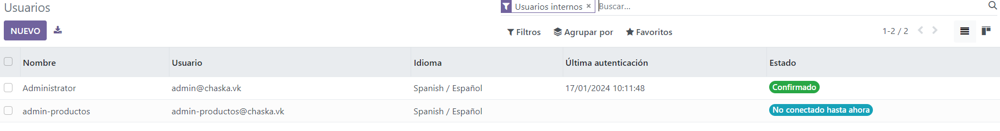

# Gestionando Odoo
En general, para todas las acciones vamos a querer tener habilitados los
permisos de desarrollador; vamos al menú (los cuadraditos de arriba a izda),
ajustes y abajo del todo activamos el modo desarrollador; ojo que necesitamos
tener al menos una app intalada para que se active (para el ejemplo habilité
el módulo de ventas, que incluye a su vez varios módulos):


## Usuarios y permisos
Cuando creemos la DB para la empresa, por defecto se nos crea un usuario admin
con todos los permisos para poder hacer cosas. Es el primer usuario con el 
que nos loggeamos, vemos el usuario con el que estamos loggeados en 
la esquina superior dcha:


Por poner un supuesto práctico: en la empresa en la que se va a instalar el
ERP hay una persona responsable de productos, que gestiona qué productos tiene
la empresa, precios, imágenes... esa persona necesita ser el admin de productos,
y solo de productos; a su vez, tiene a su cargo a 2 personas que neceitarán
consultar el listado de productos y su disponibilidad por si un cliente
pide algo. Entonces, necesito crear 3 usuarios y otrogarles permisos: al admin
le damos todo, y a los otros 2 los restringimos a solo lectura (instalo 
también el módulo de almacén).

### Crear usuario

Para crear usuarios, vamos a ajustes -> usuarios y compañías -> usuarios:


Pulsamos "nuevo" para crear usuario, hay que darle un nombre y un mail;
en la ventana de permisos de momento no vamos a tocar nada porque vamos a 
definir nosotros los permisos que tiene más adelante. La pestaña de prefencias
tiene una config básica del usuario que de momento no nos importa.

Creado el usuario, damos al botón de guardar y lo tenemos hecho:



Una cosa importante, al crear al usuario debemos darle una pass para que pueda
loggearse. Nos metemos al usuario, pulsamos en el botón de acción:


y elegimos cambiar password. Con la password y el mail el nuevo usuario
debería poder conectarse (usar otro browser para no tener que desconectarse
del admin):


Igual, creamos a otros 2 usuarios, les damos su passwod y comprobamos
que se pueden loggear. Igual que antes, no tocamos de momento permisos, y
al loggearnos con esos usuarios veremos que en ppio pueden ver y hacer todo.

### gestionando permisos
Primero vamos a quitar todos los permisos a los nnuevos usuarios creados.
Los permisos en Odoo se dan por grupos (por pertenencia de usuario a grupo) y 
por apliacación. Para gestionar permisos, vamos a un usuario a su
tab de permisos; para cada app instalada, en el menú desplegable
vemos los grupos de permisos asociados a esa app:


Si queremos saber exactamente en qué consisten estos permisos, tenemos que ir a
buscarlos a "grupos". Por ejemplo, vamos a saber qué son los permisos de 
la app de ventas que se llaman "Usuario: mostrar todos los documentos".

Vamos a ajustes -> usuarios y compañías -> grupos y buscamos "ventas"
hasta encontrar el grupo:


Si te metes al grupo, verás qué usuarios están en él (primer tab),
si particulariza otro grupo de permisos (heredado [cómo funciona esto:
lo permisos se suelen definir de menos a más, los grupos que concedan más
permisos heredan los permisos de los grupos que concedan menos permisos, y
añaden los suyos propios. En la imagen siguiente:


Un usuario en el grupo "Ventas/Usuario: mostrar todos los documentos" puede
hacer todo lo que pueda hacer el usuario del grupo "Ventas/usuario: solo 
mostrar documentos propios", más lo que definamos en este grupo])

Luego tenemos menús y vistas exclusivas de pertenecer al grupo, más adelante
tocamos aquí.

Si vamos a la tab de permisos, vems lo que puede hacer un usuario en el grupo;
se refiere siempre a operaciones CRUD sobre las tablas (modelo) que hay por 
detrás. Tocando los ticks se dan o quitan permisos al grupo. 

Ejemplo de los permisos que tiene un usuario del grupo "ventas/usuario: solo 
mostrar documentos propios" sobre el modelo "producto":


Como queríamos crear permisos sobre producto de solo lectura para los 2 usuarios
"currelas" y permisos de admin sobre producto para el admin; vamos a crear
2 grupos nuevos que incluyan solo estos permisos (en la práctica, suele
se más útil modificar un grupo de permisos que me de odoo; o crear
mi propio grupo y ampliar [heredar] de uno que me de odoo, pues el usuario
necesitará hacer bastantes más cosas).

Para crear grupos, vamos a ajustes -> usuarios y compañias -> grupos -> nuevo.

Creamos 2 grupos nuevos bajo la app "ventas", los llamamos "user" y "admin"


Añadimos a los usuarios que queremos al grupo; y de momento solo tocamos
en la tab de permisos para darle permisos de solo lectura sobre producto
(la info que tenemos que meter debemos buscarla en grupos de permisos ya
hechos):


Guardamos el grupo, y creamos otro que amplie éste (herede de) y de todos
los permisos sobre producto:


Finalmente vamos a los usuarios (ajustes -> usuarios y compañías -> usuarios)
y quitamos permisos de todo salvo los que queremos dar, que acabamos de crear
(para quitar pemrisos, por cada app, hay que seleccionar 'el vacío' entre las
opciones) Cuando creamos nuestros propio grupos Odoo nos cambia la vista a
ticks (si no se ve así, refresh de la página):


Si se autocompletan algunso ticks al guardar, es porque hayq ue sacar
manualmente a los usuarios de otros grupos de permisos en los que estuviesen.

Con los permisos ya concedidos, podemos enchufarnos a los usuarios y ver que
pueden hacer (en realidad estos usuarios no van a poder hacer nada porque
hemos quitado demasiados permisos; por eso es mejor partir de los
permisos que me da Odoo y crear nuestros propios grupos heredando. Para
que podemos ver cosas, creo 1 nuevo grupo de "admin" que hereda del dado
de Odoo "ventas/usuario: solo ver documentos propio" y le da los permisos
de write/modify/delete sobre el objeto producto; el user admin cae en
ese grupo y los user currelas caen en el básico. Cosa: he necesitado
añadir un permiso; si da un error al usuario, te dice cual es, donde
buscarlo y con eso lo puedes añadir a tu grupo de permisos). Tras los
cambios en permisos, se puede comprobar que el usurio admin puede crear
productos (y editarlos y borrarlos), y los otros solo pueden verlos
(ojo también que a veces un usuario lo marca el odoo como admin sin que
nos enteremos y puede hacer demasiadas cosas; está el tick en la 
vista del usuaro abajo del todo; si hay un mistmatch de pemrisos
Odoo te avisa)


## Menús
El menú principal es el uadradito de arriba izda; luego cada menu tiene
sub menús (que pueden tener sub menús). Van en jerarquía tipo arbol
Ventas/producto/otro submenu


En ajustes -> técnico-> interfaz usuario -> elementos de menú tenemos todos los elementos
de menu de Odoo. Igual que permisos, van por aplicación


Si vamos a un menú (del listado), lo que le vemos que nos importa es nombre del 
menú, si es submenú de otro menu (padre), y qué hace el menu (acción)


Las acciones posibles se pueden consultar en ajutes-> tecnico -> acciones
o ajustes -> técnico -> estrucutra de la DB -> modelos y buscar la tabla
ir.actions; pero la mejor manera de saber que hace cada acción es usarlas
y ver ejemplo que ya incorpore el Odoo.

Los menús tienen como objetivo llegar a sitios (a vistas), entoncces
creamos o modificamos menús para que los usuarios de Odoo lo tengan
más fácil. Por ejemplo, productos es submenú de ventas, y a los
usuarios de los productos les vendrá bien llegar a productos sin 
tener que pasar por ventas.

Para ello tenemos que crear un nuevo menu, y agregarlo a un grupo
(si no se agrega a un grupo se pone por defecto para todos).


En la creación del menú le digo que se va a llamar "Productos", que
es menú raiz (no tiene padre), y que cuando se pinche en el menú (acción)
me tiene que llevar a la vista de productos; ademáss el menú se lo asigno
al grupo "Ventas/admin", de tal manera que solo aparecerá para ese grupo.

Sí se podría seguir llegando al mismo sitio con la ruta anterior (ventas->
productos-> productos). No tiene mucho sentido mantener las 2, pero hay que
hacer una ñapa para conseguir eso. La clave está en que un menú que no
está asignado a un grupo aparece a todos los usuarios. Por tanto, si
creamos un grupo sin usuarios, podemos añadir a ese grupo todos los menús
que no queremos ver (e problema es que hay que ir buscando los menús
que queremos que "desaparezcan")

También se deben eliminar los menús asociados a un grupo concreto
yendo a la pestaña de menús del grupo:


## Vistas
Las vistas son todo; es como se presenta la info de la DB al usuario.
Las más básicas son tree (listado), Kanban (cajitas), form (formuario).
Hay más.

Las vistas que crea Odoo se ven en ajustes -> interfaz usuario -> vistas.

Las vistas tienen un nombre para identificarlas, un tipo (tree, kanban...)
y actúan sobre un modelo (una tabla).

Para ver como es una vista (la mejor manera de crear nuevas vistas es
duplicar una existente y modificarla al gusto), cuando estemos en una
damos al botón del bug y damos a editar:


Aquí estoy en la vista (kanban) que me lleva el menú Inventario/producto/producto
y tiene esta pinta:


En la misma ventana de edición de la vista tenemos info de la propia vista:
nombre, tipo, si hereda de alguien, y de que modelo (tabla) saca las cosas.

El xml define qué se muestra en la vista.

Primero vamos a modificar una vista ya existente, y primero la más sencilla,
tipo tree. Para pruebas, vamos a duplicar una vista ya existente, añadir un
menú que nos lleve a ella, y modificarla ahí.

Para duplicar la vista, buscamos su nombre en la propia vista:


Luego la buscamos en ajustes -> tecnico -> vistas; nos metemos dentro y damos a
la acción "duplicar". Le ponemos un nombre, por ejemplo el mismo nombre
y cabado en ".duplicada"

Ahora vamos a menú, creamos 2 nuevos menús: Tests-vistas (sin padre ni acción)
y "Tests-vistas-tree", cuyo padre es el menú anterior y tenemos que crearle
una acción para que nos lleve a la vista duplicada.

Para crear la acción, vamos al submenú, en acción seleccionamos
"ir.actions.act_window", que es la de que me lleve a otra ventana, y 
escribimos un nombre para la acción, por ejemplo, "ir a vista duplicada",
y pinchamos en "crear y editar":


Editando, tenemos que añadir de qué tabla coge datos (objeto), que tipo
de vista es y qué vista nos va a mostrar:


Y una vez creada debería estar todo (podemos comprobarlo yendo al menú
y en el icono del bug, ver que la vista es la duplicada)

Para modificarla, vamos al bug y seleccionamos edit tree view
(en en el propio menú de la vista), y hay que tocar el xml que la compone.

En las vista tipo tree, como el display que hacen es un listado en forma
tabular de cosas, lo básico que se añade son

```htm
<field name="nombre_de_campo_en_tabla" string="nombre_con_el_que_se_va_a_mostrar" />
```

Lo que queremos mostrar y en que orden se toca ahí.

Luego hay ciertas opciones sobre el campo a mostrar, como invisible (obvio lo que
hace), optional = {hide|show}, readonly="1" (por defecto es 0) y usar
widgets a lo cual no me voy a meter.


PDTE: ver como funcionan las vistas Kanban (será muy parecida a esta)
y sobre todo la de formulario, que requerirá hernecia

## Entidades y vistas
podemos ver la DB en ajustes -> técnico estructura de la base de datos.
En modelos están las tablas. Podemos crear nuevas entidades.

Se suele llamar a la entidad creada por ti como `x_name`.

También se pueden tablas vistas ya existentes.

Con una nueva tabla, podemos crearle una vista para mostrar lo que tenga, en 
tecnico -> vistas; ahí hay que definir el xml (copiar de vistas ya hechas
para ver cómo se escriben las cosas).

Luego hay que crear un menú para llegar las vistas; pero primero hay que
crrear una acción que nos lleve a las vistas. La básica es la de venta;
se pueden ver las acciones en técnico acciones. La acción tiene un nombre
y un tipo; que hay que buscar en el modelo de datos las acciones que
tenemos disponibles.

Luego crear elemento de menu y le añades la acción para que sepa ir a las vistas.

## relaciones
Normalmente implicará averiguar con qué tabla se tiene que relacionar; se busca 
y punto.

Para incluir una relación vamos a la tabla, y añadimos un campo para la relacion;
hay que darle en tipo de campo el tipo de relación y con quien se relaciona;
se pueden hacer mil cosas más, pero con eso bastaría; luego editamos las vistas
donde quiero que aparezca y Odoo ya sabe qué buscar y donde

## Tableros
PDTE, tengo que bichear más

## informes
es mostrar información que no debe ser modificable (para imprimir, por ejemplo)
Por ejemplo, si crear una venta vass a la vista del pedido y hay un botón
de imprimir, eso sería un informe.

En ajustes -> informes vemos los que tenemos.
El nombre de la plantilla es el xml que define al informe.
Si das a vistas QWeb te dice que vistas componen al informe.
Para crear los informes se usa un "lenguae de programación" (el qweb),
se puede encontrar más info en la docu de odoo de como se escribe.

podemos editar los informes para que muestren lo que queremos.

Los informes tienen un "tipo" de salida, se puede elegir en el informe.

Crear informes personalizados es relativamente fácil, ajustes -> informes ->
nuevo y tienes que darle un nombre, tipo, de qué tabla coge datos, un nombre
para la plantilla QWeb.

El tema es crear la vista QWeb aqui me quedo

## PDTES
- ver los tableros bien
- ver los informes bien
- herencia
- procesos para extracción
- exportación de datos
- adaptar consultas??
- procedimientos para computos