# Crear modulos propios en Odoo
Boceto, porque me quedan bastantes cosas por averiguar, especialmente
a la hora de trabajar con comodidad. 

Ya que vamos con contendores, está ajustado a este tipo de "instalación"

Lo que necesitamos en el yaml para poder trabajar es persistir el
fifhcero de config (del contenedor, que estará en /etc/odoo)
y la carpeta /mnt/extra-addons donde vamos a meter nuestras cosas.

En mi caso creo un par de volumenes para tener acceso a ello fácilmente


Tenemos que añadir a odoo.conf la ruta donde vamos a poner nuestros módulos:

```console
addons_path = /usr/lib/python3/dist-packages/odoo/addons,/mnt/extra-addons
```

Nos metemos a esa carpeta y creamos dentro otra carpeta (modulo-de-prueba)
con 2 ficheros vacíos: __init__.py y __manifest__.py.

Rellenamos el __manifest__.py con lo siguiente:

```python
{
    'name': 'mi modulo de prueba',
    'version': '1.0.0',
    'summary': 'Test Module',
    'author': 'mi compañia',
    'website': 'https://www.mycompany.com',
    'depends': [
        'base',
    ],
    'data': [
    ],
    'installable': True,
    'application': True,
    'auto_install': False,
}
```

Nos enchufamos a Odoo, activamos modo desarrollador y damos a actualizar lista
de aplicaciones. Debería salirnos nuestra cosa.

En realidad en la carpeta del módulo deberíamos tener la siguiente estructura
de directorios, a la misma altura que init y manifest, 
que es la que vamos a necesitar:

- controllers
- demo
- models
- security
- views

## models
en la carpeta models, creamos un init y un fichero models.py,
que es lo que tiene la info de las tablas. Se crean como clases de python, un 
ejemplo (simula libros y categorías de libro):

**Reestructurado a que sean 2 ficheros**

```python
from odoo import models, fields

class libros_categoria(models.Model):
    # mandatory
    _name = "libros.categoria"

    # mandatory
    name = fields.Char(string="Nombre Categría", required=True, help="Ayuda para saber que info lleva este campo")

    descripcion = fields.Text(string="Description")

```

```python
from odoo import models, fields

class libros_libro(models.Model):
    _name = "libros.libro"

    name = fields.Char(string="Nombre Libro")
    precio = fields.Float(string="Precio")
    num_ejemplares = fields.Integer(string="Numero Ejemplares")
    fecha_compra = fields.Date(string="fecha de compra")
    segunda_mano = fields.Boolean(string="2ª mano")
    estado = fields.Selection([('0','Nuevo'),('1','Usado')],string="estado",default='0')

```
Quedaría simplemente añadir los imports en los ficheors `__init__.py`:

```python
# models/__init__.py
from . import libros_categoria
from . import libros_libro
```

```python
# mi-modulo/__init__.py
from . import models
# from . import views
# from . import security
# from . import demo
# from . import controllers
```


Tras crear los modelos, se reinicia el servicio y al darle a "instalar" al
módulo debería crearnos las tablas

## views
Se almacenan en la carpeta views, y contienen las vistas de los modelos,
acciones de ventana y menús

el fichero debe tener info así:

```xml
<odoo>
    <data>
        <!-- tree -->
        <record model="ir.ui.view" id="id-unico-para-la-vista">
            <field name="name">nombre.de.la.vista</field>
            <field name="model">tabla.de.la.que.saca.datos._name</field>
            <field name="arch" type="xml">
                <tree>  
                    <field name="nombre-campo" />
                    <!-- los campos que queramos -->
                </tree>
            </field>
        </record>

        <!-- form view -->
        <record model="ir. ...">
            <!-- los field como antes, adaptar -->
                <form>  
                    <group colspan="2" col="2">
                        <!-- los campos que queramos -->
                    </group>
                </form>
        </record>

        <!-- accion ventana -->
        <record model="ir.actions.act_window" id="id-para-la-accion">
            <field name="name">nombre.de.la.accion</field>
            <field name="res_model">tabla.de.la.que.saca.datos._name</field>
            <field name="view_mode">tree,form</field>
        </record>

        <!-- elemenos de menu -->
        <menuitem name="nombre-de-mi-menu" id="id-de-mi-menu" />
        <menuitem name="nombre-de-mi-menu" id="id-de-mi-menu" parent="nombre-del-menu-parent" action="id-de-la-accion-que-realiza-el-manu"/>
    </data>
</odoo>
```

## Ejemplo que he conseguido hacer funcional:

creas los modelos en sus ficheros py; crear las vistas, acciones de ventana,
elementos de menu, crear los permisos:

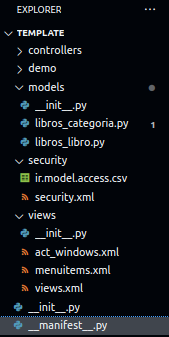

El contenido de los modelos:

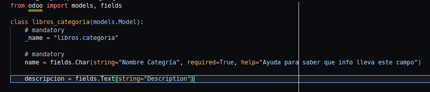

Hay que cargar las cosas de python usando los __init__ (from . import lo-que-sea)

Hay que cargar las cosas en manifest:

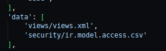

hay que rellnar las views asi (seguramente se puedan distribuir en varios ficheros)

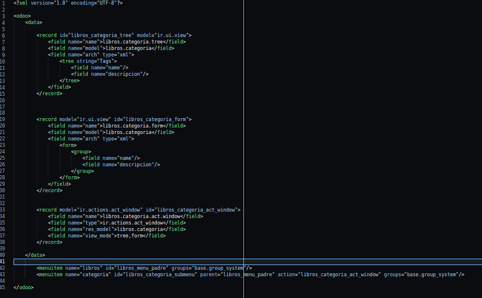

hay que crear el fichero para dar los permisos, que tiene que ir en formato csv:

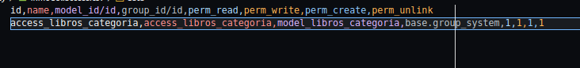

El fichero de security sirve para definir tus propios grupos de permisos, 
un ejemplo sería de creación de un grupo propio de permisos: 

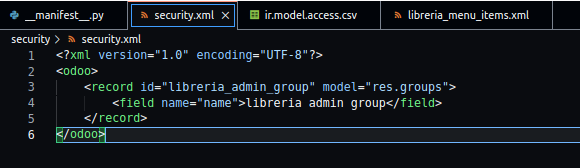


Tras crear tu propio grupo, tienes que darle los permisos sobre los modelos en
`ir.model.access.csv`, en este caso le doy todos los permisos:

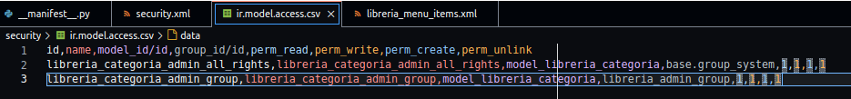

Y finalmente añadir el grupo a los menús:

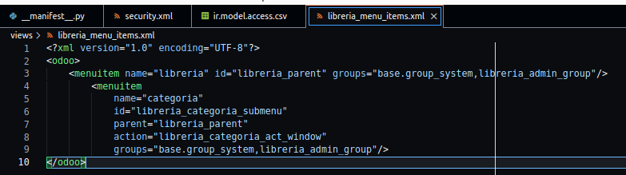

Y por supuesto añadir el xml en el manifest; con esto (y seguramente un 
reinicio de servicio y/o actualización del módulo), puedes crear usuarios
y añadirlos al grupo para que puedan hacer cosas.

### Relaciones
En el ejemplo, tienes libros y categorias; queremos obviamente la relación
de 1 libro pertence a 1 categoría y a 1 categoria pertenecen muchos libros;
entonces en el libro es rel many2one y en la categoria es one2many 
(la que falta sería many2many). Se definen en los modelos  de la siguiente 
manera:

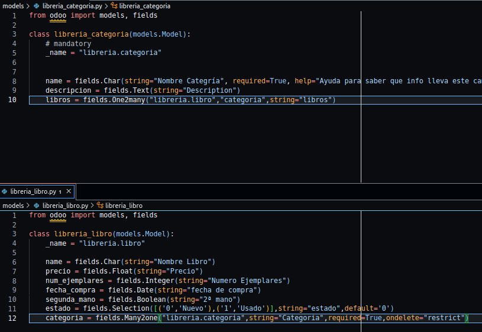

He puesto el "ondelete" a restrict, la única otra opción es "cascade"

Y cambias las vistas también para que cojan el campo:

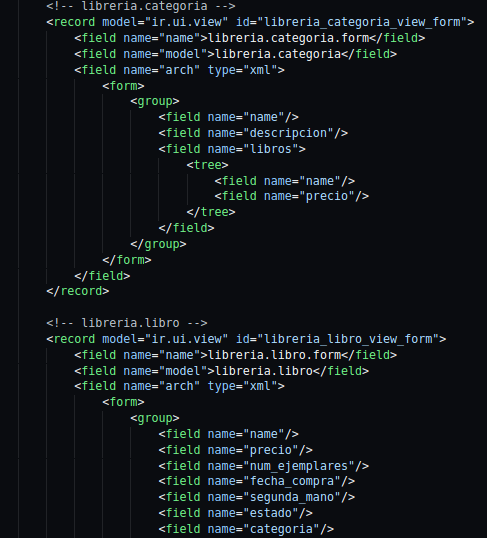

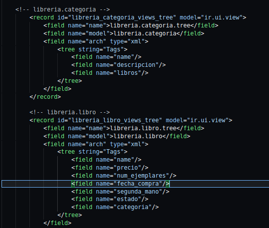

En la vista de formulario de categoria hemos metido una vista de tree 
dentro del formulario para que se vea guay

### Campos caluculados
se defien en las clases; vamos a calcular el típico de precio*unidades;
para ello solo hay que definir un método (el `_` antes del nombre
del método es obligatorio, aunque no lo he comproobado); por lo demás la única "restriccion"
es que se necesita un for;

Luego tabién se añade un decorator para que python sepa cuándo llamar al método:

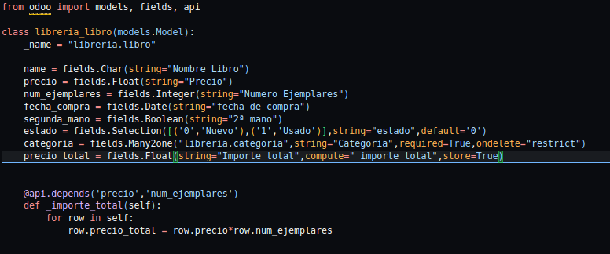